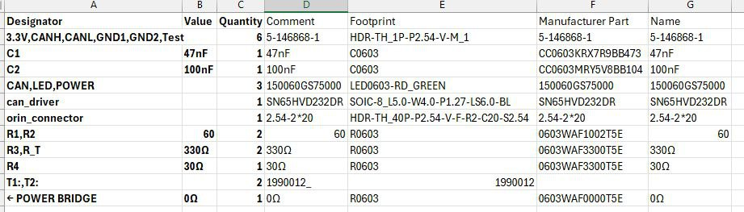
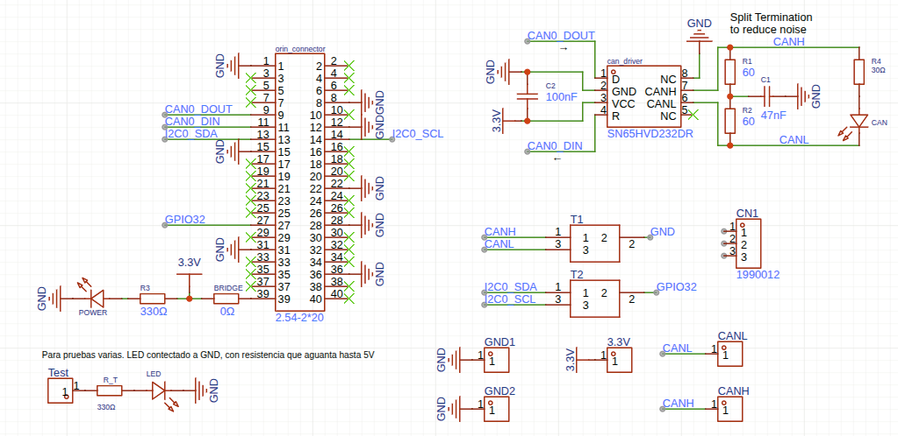
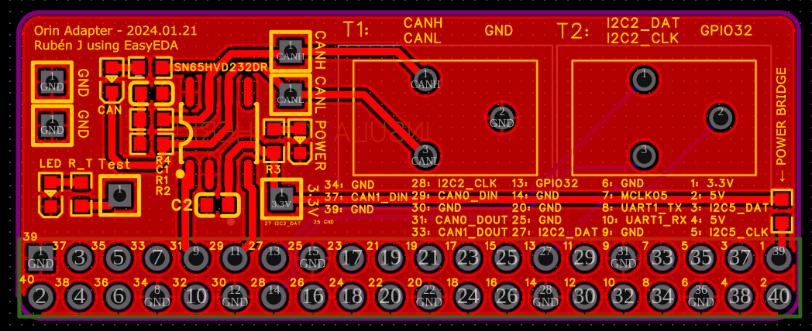
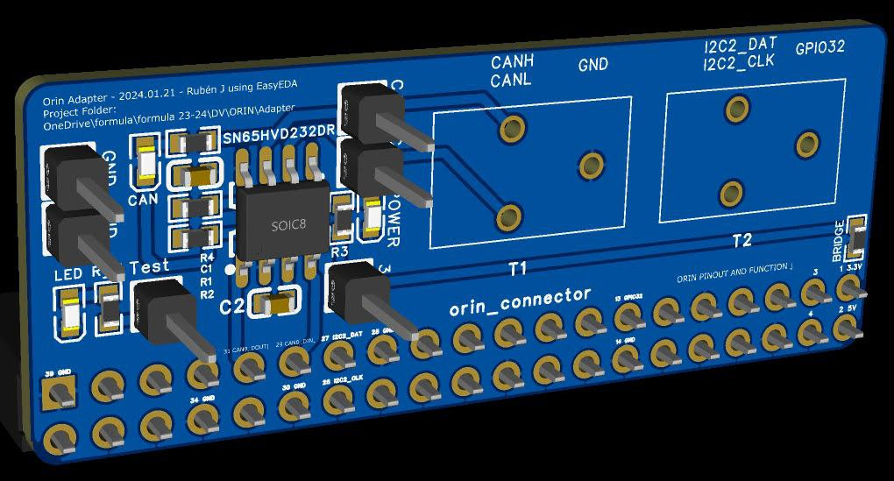

# Computer
Our computer is based on the NVidia Jetson AGX Orin Development Kit.

# Links
- Main Nvidia Jetson AGX Orin page: https://developer.nvidia.com/embedded/learn/jetson-agx-orin-devkit-user-guide/developer_kit_layout.html
- Datasheets for NVidia Jetson Orin: https://developer.nvidia.com/embedded/downloads
TODO link here to datasheets in the repo itself

# Data
## Power
- Power consumption: 
- Voltage range: 9-20VDC, typically 19V
- Power connector: Barrel Jack 5.5mm OD 2.5mm ID center positive

## Specs
TODO

# To connect it to the rest of the kart, we use a custom made adapter board
## This is the version 1.0 of the adapter board
Designed with [easyeda](https://easyeda.com/), can be downloaded [here](computer/images/ProProject_Orin Adapter_2025-03-09.epro)

### BOM (Bill of Materials)


### PCB Schematic


The schematic shows the component values and connections:
- **Power Supply**: 3.3V, 5V regulated outputs
- **CAN Interface**: SN65HVD232DR transceiver for CAN communication
- **Connectors**: 2.54-2*20 header for Orin connection
- **Filtering Capacitors**: C1 (47nF), C2 (100nF) for noise suppression
- **Resistors**: R1,R2 (60Ω), R3,R_T (330Ω), R4 (30Ω)
- **Test Points**: T1, T2 for debugging

### PCB Board Top View


### 3D Visualization


The path in our Owncloud folder is: `formula/formula 24-25/DV/ORIN/adapter/ProProject_Orin Adapter_2025-03-09.epro`

# Notes
## How to install Anydesk in Nvidia Jetson Orin
```bash
wget -qO - https://keys.anydesk.com/repos/DEB-GPG-KEY | sudo apt-key add -
echo 'deb http://deb.anydesk.com/ all main' | sudo tee /etc/apt/sources.list.d/anydesk.list
sudo apt update                                                     
sudo apt install -y anydesk
```


