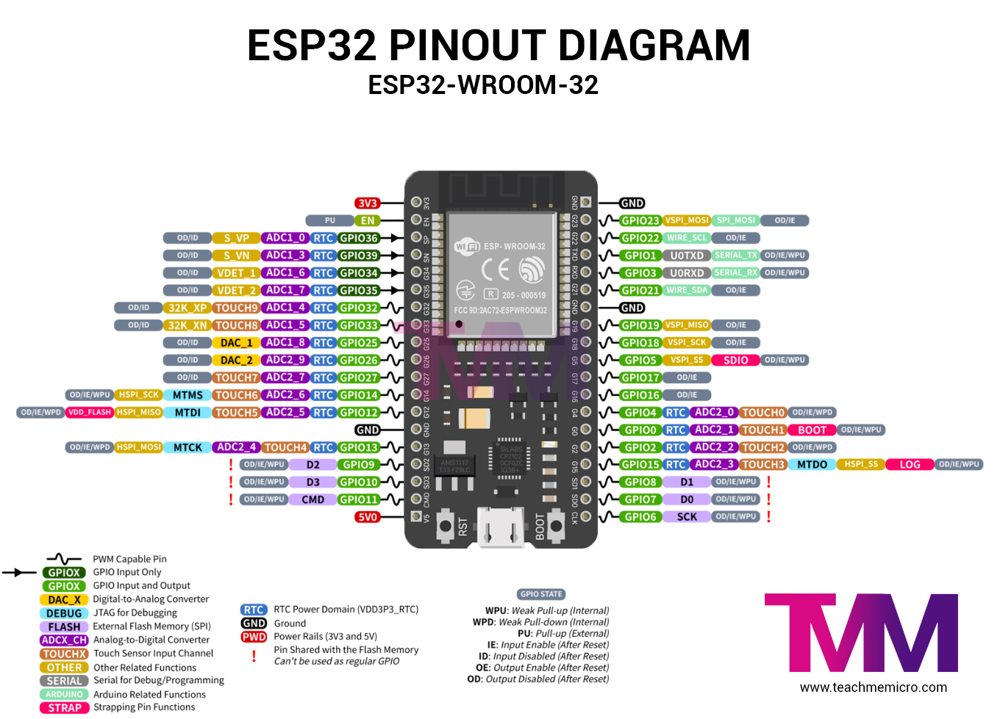

---
# BOM Entry
bom:
  component_id: "ESP32_WROOM_32"
  part_number: "ESP32-WROOM-32"
  category: "microcontroller"
  quantity: 1
  unit_cost: 3.50
  currency: "EUR"
  status: "active"
  criticality: "essential"
  suppliers:
    - name: "Mouser"
      part_number: "356-ESP32WROOM32"
      url: "https://www.mouser.com/ProductDetail/356-ESP32WROOM32"
      verified: true
    - name: "AliExpress"
      url: "https://www.aliexpress.com/wholesale?SearchText=esp32+wroom+32"
      verified: false
  specifications:
    voltage: "3.3V"
    current: "240mA"
    temperature: "-40°C to +85°C"
    flash: "4MB"
    ram: "520KB"
  alternatives:
    - "ESP32-S3"
    - "ESP32-C3"
---

# ESP32

The ESP32 is a series of low-cost, low-power system on a chip microcontrollers with integrated Wi-Fi and dual-mode Bluetooth. The ESP32 series employs a Tensilica Xtensa LX6 microprocessor in both dual-core and single-core variations and includes built-in antenna switches, RF balun, power amplifier, low-noise receive amplifier, filters, and power management modules.

## Key Features

*   **CPU:** Xtensa dual-core (or single-core) 32-bit LX6 microprocessor
*   **Clock Speed:** Up to 240 MHz
*   **Wi-Fi:** 802.11 b/g/n
*   **Bluetooth:** Bluetooth v4.2 BR/EDR and BLE
*   **Flash Memory:** Up to 16 MB
*   **SRAM:** 520 KB
*   **GPIOs:** 34
*   **ADCs:** 18-channel, 12-bit
*   **DACs:** 2-channel, 8-bit
*   **Communication Interfaces:** SPI, I2C, UART, CAN, I2S

## Kart Medulla - ESP32 WROOM 32 Configuration

The ESP32 serves as the "medulla" of the kart, interfacing between the Orin computer, steering angle sensor, and motor driver.

### Pin Assignments

| GPIO Pin | Function | Connected To |
|----------|----------|--------------|
| GPIO 2   | LED      | Onboard LED |
| GPIO 18  | UART RX  | Orin TX |
| GPIO 19  | UART TX  | Orin RX |
| GPIO 21  | I2C SDA  | AS5600 SDA |
| GPIO 22  | I2C SCL  | AS5600 SCL |
| GPIO 25  | PWM      | Motor Driver PWM |
| GPIO 26  | DIR      | Motor Driver Direction |

## Wiring Connections

### ESP32 to AS5600 Angle Sensor

| AS5600 Pin | ESP32 Pin | Wire Color (2025) |
|------------|-----------|-------------------|
| SCL        | GPIO 22   | Blue |
| SDA        | GPIO 21   | Green |
| VCC        | 3.3V      | White |
| GND        | GND       | Grey |

!!! warning "Temporary Color Code"
    Wire colors are specific to the 2025 version and not official. Always verify connections.

### ESP32 to Motor Driver

| Motor Driver Pin | ESP32 Pin |
|------------------|-----------|
| PWM              | GPIO 25   |
| DIR              | GPIO 26   |
| VCC              | 5V        |
| GND              | GND       |

### ESP32 to Orin (UART Communication)

| Orin Pin | ESP32 Pin |
|----------|-----------|
| TX       | GPIO 18   |
| RX       | GPIO 19   |
| GND      | GND       |
