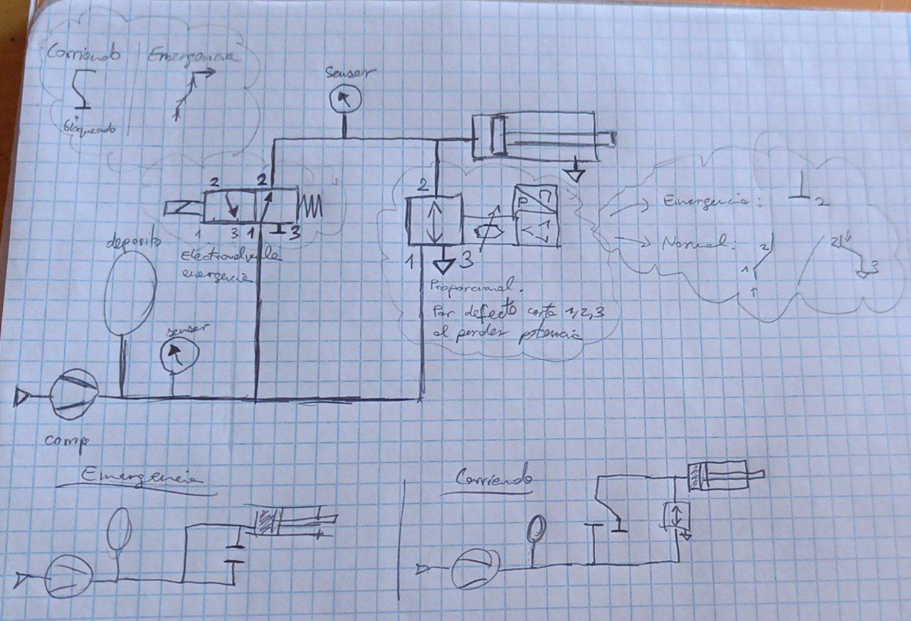

# Pneumatics
We need an emergency braking system that can be activated on loss of electrical power or error from the shutdown loop, and a proportional braking system that can be controlled by the main computer when the robot is running.

TODO redesign circuit with the valves we have, instead of using two different ones. 

TODO order components: proportional valve, adapters to have no problems using any of our tanks, pressure sensors, 

> Original Idea:
> Use a ball valve to merge the proportional braking line with the emergency one, and an extra electrovalve to stop flow to the proportional valve when emergency.

## Simplified design (TODO simulate it)
If the proportional valve does close both ways when not powered, we can get rid of the valve that goes in series with it. If we close port 3 of the emergency electrovalve, we can get rid of the valve with the ball at the top.

## Components
- [Solenoid valve](https://www.festo.com/tw/en/a/575488/)
    > For emergency braking
    - [Datasheet local](../../assets/datasheets/575488datasheet.pdf)
    - [Datasheet online](https://www.festo.com/tw/en/a/download-document/datasheet/575488)
    - G1/4 female thread
- [Proportional Valve](https://www.festo.com/es/es/a/8153644/)
    > For normal controlled braking
    - TODO CONSIDER AN 8-PIN M16 PROPORTIONAL VALVE SO WE CAN USE IT AS PRESSURE SENSOR
    - [Datasheet online](https://www.festo.com/es/es/a/download-document/datasheet/8153644)
    - [Datasheet local](../../assets/datasheets/8153644datasheet.pdf)
    - [206533 documentation](../../assets/datasheets/206533_documentation.pdf)
    - TODO QUESTION: Can we get the reading of pressure from this valve? There are some that allow it
- Fittings:
    - 90º TODO what thread what size, what tube material and OD/ID.
    - Straight TODO what adapters
- Pressure sensor
