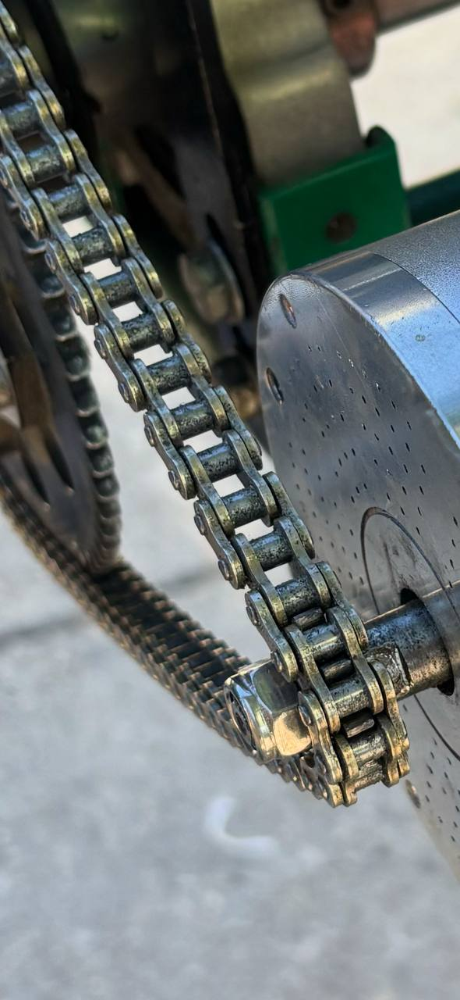
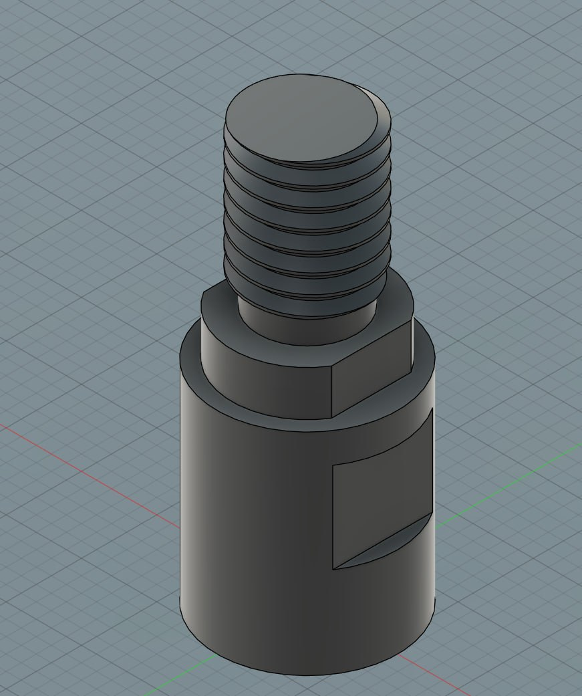
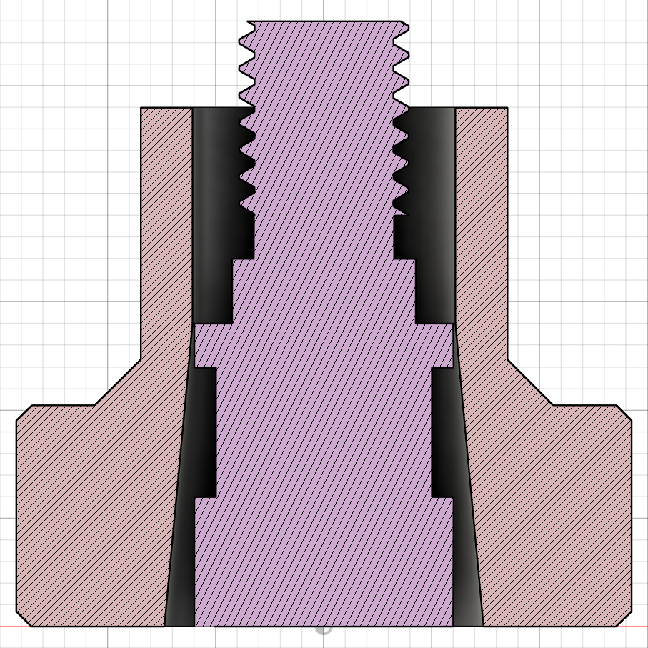

# Transmission System

## Current Configuration - 219 Kit

The kart currently uses a **standard 219 pitch karting transmission system**. This is the definitive configuration after testing and discarding the original T8F kit that came with the motor.

### Components

#### Chain

??? example "View gold 219 chain installed on the kart"
    

- **Type:** IRIS 219 pitch chain
- **Color:** Gold
- **Length:** 100 links
- **Status:** Installed and working
- **Purchase link:** <a href="https://kpsracing.es/cadenas-y-cubrecadenas/2434-649-cadena-iris-219.html#/254-numero_pasos_cadena-100" target="_blank">IRIS 219 Chain at KPS Racing</a>

#### Rear Sprocket (Corona)
- **Type:** Aluminum 219 pitch sprocket
- **Color:** Black anodized
- **Teeth:** *(Check sprocket for exact number)*
- **Status:** **Damaged - needs replacement** (~20€)
- **Damage cause:** Used incorrectly with T8F chain (incompatible pitch)
- **Replacement link:** <a href="https://kpsracing.es/coronas/5957-9775-corona-aluminio-219-negra.html" target="_blank">219 Aluminum Sprocket at KPS Racing</a>

#### Front Sprocket (Piñón)
- **Type:** Custom 219 pitch sprocket
- **Manufacturing:** Laser cut (custom design)
- **Material:** Steel
- **Teeth:** Multiple options manufactured with different tooth counts
- **Special features:** Custom design for non-standard Chinese motor shaft

---

## About chain pitch standards

The karting industry primarily uses three chain pitch standards:

1. **#219** - Standard karting chain (7.774mm pitch)
2. **#35**  - Smaller chain used in some mini karts (9.525mm pitch)
3. **#428** - Larger chain used in heavy-duty karts (12.7mm pitch)

The kart currently uses the **#219** standard, which is the most common for 2-stroke racing karts. We made this choice because:

- It is widely available and supported in the karting community.
- It offers a good balance of strength, weight, and size for our kart.
- It is compatible with the sprockets we can source or manufacture.
- It allows for easy future upgrades or changes to the drivetrain.
- It was the closest match to the motor's original transmission kit. Initially, we thought that maybe the difference in pitch between T8F and 219 was negligible and we might avoid design any part, but after testing we found that it was not the case.

> **Note:** The original T8F kit that came with the motor is not a standard karting pitch and has been discarded in favor of the #219 system. However, as a temporary measure, part of the original T8F kit was used to get the kart moving initially, since we knew the switch to #219 would take some time due to sourcing parts and manufacturing the custom front sprocket. In this process, the rear sprocket was damaged due to the incompatible chain pitch, and it needs to be replaced.

## Why did you discard the T8F kit?

The T8F kit was not suitable for long-term use because is not a standard karting pitch, making it hard to find compatible parts locally. One of the requirements we established early on was to use components that could be easily sourced or replaced in case of failure, since **this kart was never intended to complex hardware development but software development**. Having a non-standard pitch would complicate maintenance and repairs, especially in a development environment where quick and cheap fixes are often needed due to failures or changes.

## Why Custom Front Sprocket?

The motor we purchased (Kunray MY1020) comes with a non-standard shaft configuration:

- **Shaft diameter:** 10mm
- **Keyway:** None
- **Length:** Very short

This is a 1:1 representation of the shaft configuration of the motor we purchased:

The rear sprocket in the T8F kit could not be mounted on the kart's axle easily. There are standard sprocket mounting options for a wide range of both kart axles and rear sprockets, but since T8F is not a standard karting pitch, we could not find a compatible rear sprocket mount that would fit our kart axle right away. Design and manufacturing of a custom rear sprocket mount was considered too complex and expensive for our needs, as well as time consuming. Knowing that we would eventually switch to a standard karting pitch, we decided to discard the T8F kit entirely.

You can see here both the price and images of the rear sprocket mount we actually mounted: [219 Rear Sprocket Mount - 40mm Axle](https://kpsracing.es/portacoronas-y-portadiscos/3386-portacorona-40mm-tipo-219.html). Its mounting holes do not match the original T8F rear sprocket mounting holes. We would have to design a custom rear sprocket mount if we wanted to keep using the T8F kit. This is why we discarded the T8F kit entirely.

However, since the motor shaft was either not standard on karting motors, or at least not compatible with standard karting sprockets, we were forced to design and manufacture a custom front sprocket that would fit the motor shaft while maintaining the 219 pitch for chain compatibility. Contrary to the rear sprocket, the front sprocket is much simpler to design and manufacture, as it only needs to fit the motor shaft securely. This was done via laser cutting service for a minimal cost. In fact, it was as easy as replicating the inner geometry of the original T8F front sprocket, which was designed to fit the motor shaft, and then adapting the outer geometry to match the #219 pitch standard. A matter of hours of CAD work and a few iterations to get the tooth count right.

Here you can see a cross section of both the [simplest #219 front sprocket](https://kpsracing.es/pinones-motor/2280-425-pinon-tipo-iame-20mm.html#/92-talla-10z) we could find and the motor shaft, before deciding to design a custom sprocket:

There was no way to adapt this standard sprocket to the motor shaft without extensive machining, which would have been more expensive than simply designing and manufacturing a custom sprocket.

> The custom sprocket design was completed and validated (3D printed) in January 2025 and manufactured via laser cutting service for a minimal cost in May 2025. However, due to laser cutting limitations, teeth are not chamfered, which may affect chain engagement slightly. This can be improved in future iterations by using CNC machining, which can produce more precise and durable sprockets. For now, the laser-cut sprocket is sufficient for testing and development purposes if we are careful with chain tensioning and alignment.

---

## Discarded T8F Kit

The motor originally came with a T8F transmission kit:

- **Chain:** Black T8F chain
- **Rear sprocket:** Black T8F sprocket (never used)
- **Front sprocket:** Black T8F 11-tooth sprocket

This kit was never intended for permanent use because as discused before, T8F is not a standard karting pitch. However, some components were temporarily used to get the kart moving while waiting for the 219 chain and custom front sprocket to arrive.

We have damaged knowingly the rear sprocket by using it with the incompatible T8F chain and front sprocket, which is why we need to replace it. Both chain and front sprocket are already replaced with the #219 equivalents.

**⚠️ These T8F components should be stored separately or discarded to avoid confusion.**

---

??? info "What do 219 and T8F mean? (Technical Details)"

    ### Chain Designation Explained

    **219 Chain**
    - Standard karting chain designation
    - Pitch: 7.774mm (0.306")
    - Roller diameter: 4.59mm
    - Originally invented as timing chain for Kawasaki motorcycles
    - European/Japanese standard for 2-stroke karting
    - Does NOT follow standard ANSI numbering formula

    **T8F Chain**
    - "T" = Chain type designation
    - "8" = 8mm pitch
    - "F" = Manufacturer designation
    - Pitch: 8.000mm
    - Roller diameter: 4.7mm
    - Common in Chinese electric scooters and pocket bikes
    - Also known as 05B chain

    ### What is "Pitch"?

    The **pitch** is the distance between the centers of two consecutive chain rollers. It's the most critical measurement for chain compatibility.

    ### Typical Usage

    - **219**: Professional karting standard, especially 2-stroke racing in Europe and Japan
    - **T8F**: Electric scooters, pocket bikes, and electric mobility devices (mainly Chinese market)

---

## Installation Notes

With the motor mount moved slightly backward (compared to the original 3D-printed mount), there is now sufficient clearance to properly install and tension the #219 chain.

### Correct Configuration Checklist

- Gold 219 chain installed
- 219 rear sprocket mounted (replace damaged one first)
- Custom 219 front sprocket mounted
- Proper chain tension adjusted
- All T8F components removed from work area

---

## Future Improvements

- Document exact tooth counts for ratio calculations
- Add chain tensioning procedure
- Include maintenance schedule
- Calculate speed/torque ratios for different sprocket combinations