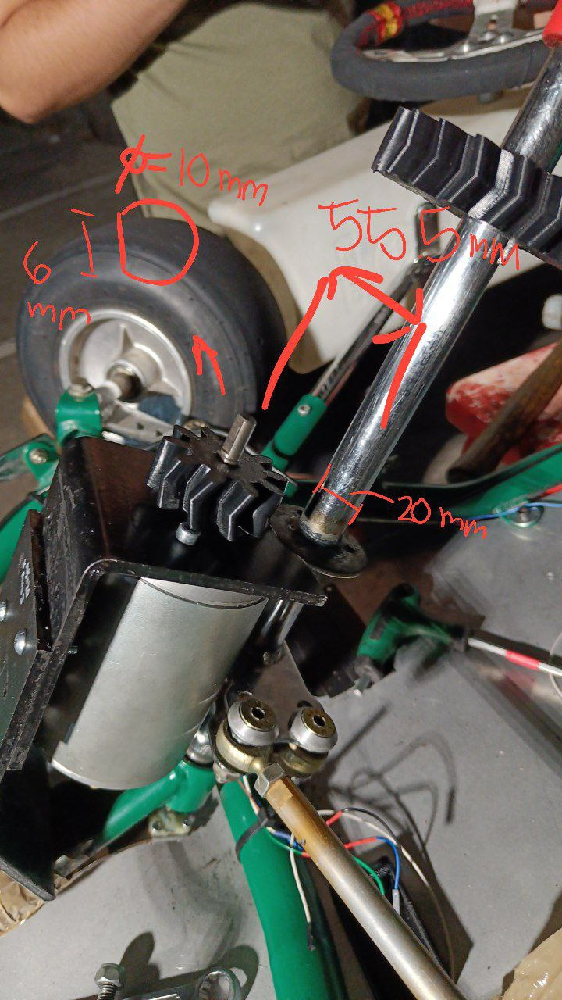

# Steering Assembly Fasteners

## Fasteners Overview

This page documents all fasteners used in the steering assembly with precise identification using the annotated reference photo. Each bolt is numbered for easy identification during assembly or maintenance.

!!! warning "Critical Safety"
    Steering fasteners are safety-critical. Use specified torque values and threadlocker. Inspect regularly for looseness.

## Reference Photo

??? example "View steering assembly with numbered fasteners"
    

    **Fastener Identification:**
    1. Coupling to motor bolts (4x M6x20)
    2. Main coupling bolt (1x M8x25)
    3. Sensor mounting screws (2x M3x8)

## Detailed Fastener Specifications

### Item #1: Coupling to Motor Bolts
- **Quantity**: 4 bolts
- **Size**: M6 x 20mm hex head cap screws
- **Location**: Motor flange to coupling connection
- **Torque**: 12 Nm
- **Material**: Steel, zinc plated
- **Installation**: Apply threadlocker, torque in cross pattern
- **Inspection**: Check weekly for looseness

### Item #2: Main Coupling Bolt
- **Quantity**: 1 bolt
- **Size**: M8 x 25mm hex head cap screw
- **Location**: Through steering shaft coupling
- **Torque**: 20 Nm
- **Material**: Steel, grade 8.8 (high strength)
- **Installation**: Critical connection - use threadlocker
- **Inspection**: Check bi-weekly, this bolt failure would disable steering

### Item #3: Sensor Mount Screws
- **Quantity**: 2 bolts
- **Size**: M3 x 8mm hex head cap screws
- **Location**: AS5600 sensor board to mounting bracket
- **Torque**: 3 Nm (be careful not to over-torque small screws)
- **Material**: Steel, zinc plated
- **Installation**: Hand-tighten plus 1/4 turn
- **Inspection**: Monthly visual check

### Motor Bracket Bolts
- **Quantity**: 2 bolts
- **Size**: M6 x 30mm hex head cap screws
- **Location**: Steering motor to chassis mounting bracket
- **Torque**: 15 Nm
- **Material**: Steel, zinc plated
- **Installation**: Ensure motor alignment before final tightening
- **Inspection**: Weekly check for vibration loosening

## Assembly Instructions

### Installation Sequence
1. **Mount sensor first**: Install AS5600 with Item #3 screws
2. **Position motor**: Mount motor to chassis with bracket bolts
3. **Install coupling**: Connect motor to shaft with Item #1 bolts
4. **Final connection**: Install main coupling bolt (Item #2)
5. **Test**: Verify smooth operation and sensor reading

### Critical Notes
- **Alignment**: Ensure motor shaft and steering shaft are properly aligned before tightening
- **Sensor position**: AS5600 must be centered over magnet (see sensor documentation)
- **Threadlocker**: Use blue (medium strength) on all bolts except sensor screws

## Maintenance Schedule

| Fastener | Check Frequency | Torque Check | Notes |
|----------|-----------------|--------------|-------|
| Item #1 (Coupling) | Weekly | Monthly | Critical for power transmission |
| Item #2 (Main bolt) | Bi-weekly | Bi-weekly | Most critical fastener |
| Item #3 (Sensor) | Monthly | Quarterly | Avoid over-torque |
| Bracket bolts | Weekly | Monthly | Check for vibration loosening |

## Troubleshooting

### Loose Steering Feel
- Check Item #2 main coupling bolt first
- Inspect Item #1 coupling bolts for looseness
- Verify motor bracket bolt tightness

### Sensor Reading Issues
- Check Item #3 sensor mount screws
- Verify sensor hasn't shifted position
- Ensure magnet alignment hasn't changed

## Procurement Information

### Estimated Costs
- **Total fastener cost**: ~€5.50 for complete steering assembly
- **Recommended spares**: 25% extra quantity

### Suppliers
- **McMaster-Carr**: Premium quality metric fasteners
- **Fastenal**: Industrial fastener supplier
- **Local automotive**: Grade 8.8 bolts available at auto parts stores

### Required Tools
- **Hex key set**: 3mm, 6mm, 8mm
- **Torque wrench**: 0-25 Nm range
- **Threadlocker**: Loctite 243 (blue, medium strength)