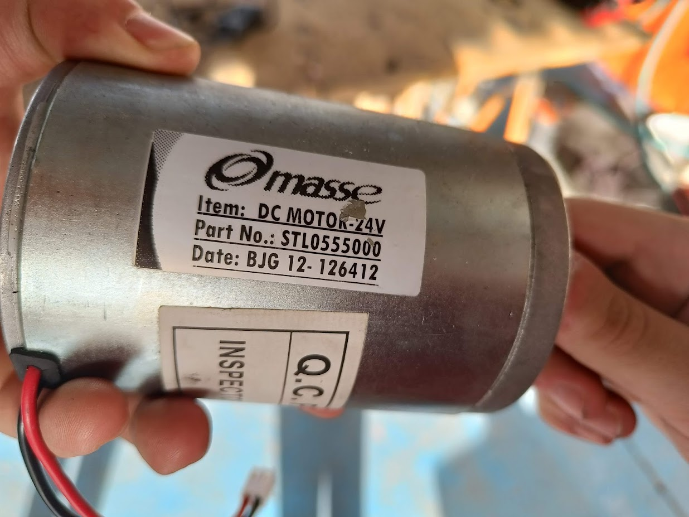

# Steering System

## Mechanical Overview

??? example "View steering mechanism with measurements"
    

The steering system uses a direct drive motor connected to the steering column. Key dimensions:
- Steering column diameter: 20mm
- Motor mount spacing: 50mm
- Connection diameter: 10mm (internal)

## Motor Data

24V motor, we will use it at 12V, estimated about 300W

## Main process
We need to move the steering shaft to the target angle.

1. Micro controller reads target position from main computer (Orin) and current position from the Hall effect sensor
    - Micro controller may be a Blue Pill, Teensy 4.0, or one with CAN transceiver builtin.
2. Calculates PWM % value with PID. Sends PWM 3.3V to H-bridge
3. H-bridge (MD30C) receives PWM and powers the DC motor
    - ChatGpt said it can't work with 3.3V PWM, just 5V PWM, but the datasheet says otherwise [here](../../assets/datasheets/MD30C%20Users%20Manual.pdf)

## H-bridge data
See [H-bridge](h-bridge.md) for more details.

## Power Requirements Investigation

### Torque Requirements
- **Reference torque**: ~40 Nm
- **Target performance**: 1 full revolution (lock-to-lock) in 0.3 seconds
- **Required power**: 40 Nm × (2π rad / 0.3 s) = **837 W**

### Design Constraints
- **Available voltages**:
  - Battery: 13S (41.6V - 54.6V)
  - Regulated: 12V, 5V, 3.3V
- **Budget**: < 1000€ for new components
- **Note**: Consider integrated servos as an alternative to separate electronics

### Power Alternatives Under Investigation

??? info "Motor Driver Alternatives (Click to expand)"

    #### VESC (Vedder Electronic Speed Controller)
    - **Advantages**: Multi-purpose, can be reused for other systems
    - **Implementation**:
        - Test with existing unit first
        - ESP32 communication via UART at 3.3V
        - Keep AS5600 magnetic sensor on I2C
        - Note: VESC DC mode doesn't include position control, external PID needed
    - **Alternative unit**: [Flysky FSESC67100 V2 Pro on Wallapop](https://es.wallapop.com/item/flysky-fsesc67100-v2-pro-1133224964)

    #### Kelly Controller KDS Series
    - **Link**: [Kelly Controller Shop](https://kellycontroller.com/shop/kds/)
    - **Specs**: ~60€, 48V (max 60V), 50A
    - **Control**:
        - 0-5V analog signal for power
        - REV/DIR signal for direction
        - Requires external microcontroller with PID for position control

    #### AllMotion EZSV23WV Servo Controller
    - **Link**: [AllMotion EZSV23WV](https://www.allmotion.com/ezsv23wv-servo-control)
    - Integrated servo control solution

    #### Generic PWM Motor Controller
    - **Link**: [Component Authority DC Motor Controller](https://componentauthority.com/products/dc-10-55v-max-60a-pwm-motor-speed-controller-cw-ccw-reversible-12v-24v-36v)
    - **Specs**: 10-55V DC, Max 60A, CW/CCW reversible
    - Works like current Cytron solution
    - Use with ESP32 for same control method

    #### Decision Matrix
    *To be completed once alternatives are evaluated*

### Gear Reduction Investigation

**Requirements**: Minimum 5:1 reduction ratio, especially shorter teeth on pinion gear

??? info "Reduction Alternatives (Click to expand)"

    #### Direct Gear Change
    - Replace current gears with 5:1 ratio set
    - Focus on shorter teeth for pinion gear
    - Crown gear can remain similar size

    #### Planetary Gearbox Addition
    - Research compatibility with current motor
    - Options:
        - 3D print custom adapter if needed
        - Drill mounting holes in steel L-bracket
        - Modify existing mounting plate

    #### Complete Motor/Servo Replacement
    - Consider integrated servo motor with built-in reduction
    - Higher initial cost but simpler integration

    #### Decision Matrix
    *To be completed once alternatives are evaluated*
