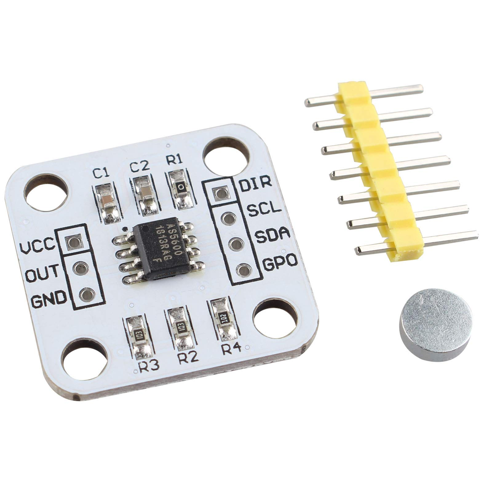
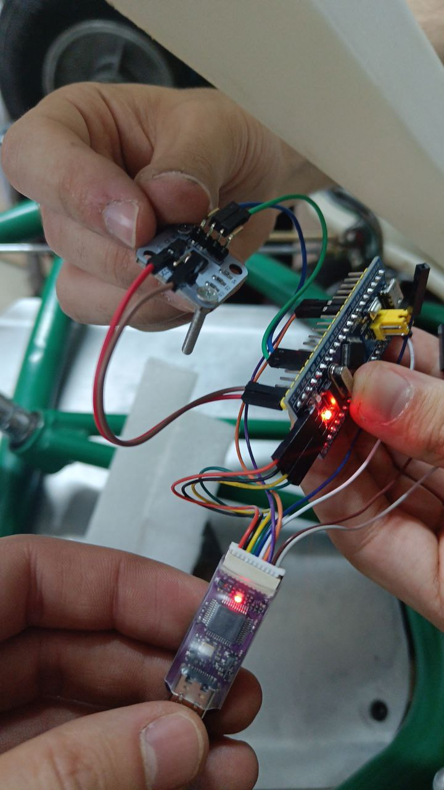
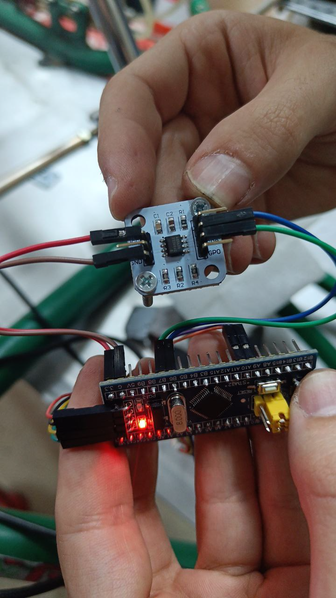

# Steering Angle Sensor

Sensor used is the cheap AS5600

Intended for use with a diametrically magnetized magnet, but works with a normal one turned 90 degrees too.
It may be a good idea to find bigger neodymium diametric magnets.

## AS5600 Wire Colors (2025 Temporary)

!!! warning "Temporary Color Code"
    This color code is specific to the 2025 version wiring and is not official. Verify connections before use.

| Color | Signal |
|-------|--------|
| Grey  | GND    |
| White | 3.3V   |
| Green | SDA    |
| Blue  | SCL    |

## Code Repository

Repo with basic code to read the steering angle sensor (Arduino HAL with VSCode Platformio, no IDE): https://github.com/rubenayla/bluepill-angle-arduino.git

