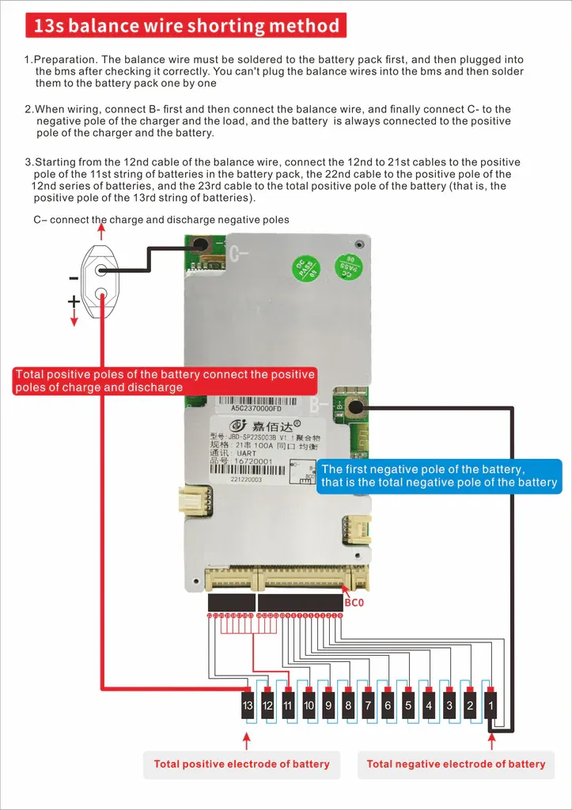

# Battery

> To charge the battery with a bench power supply, see this tutorial: [Cómo Cargar una Batería de Litio con una Fuente](https://youtu.be/g1jsSbjsiTo?si=uZ7mVjXA2c-43zzz)

The main pack uses **Molicel P42A** cells in a 13S4P configuration, providing a nominal voltage of about 48 V. A separate 12 V car battery supplies the sensors to remain compatible with the Formula Student car.

For battery placement rationale see the [FAQ](../../../faq.md#battery).

| Parameter | Value |
|-----------|-------|
| BMS Cutoff voltage | 39.0 V (13 * 3.0V) |
| Configuration | 13S4P (13 cells in series, 4 in parallel) |
| Nominal voltage | 48 V |
| Maximum charging voltage | 54.6 V (13 * 4.2V) |
| Minimum voltage | 41.6 V (13 * 3.2V) |
| Power Capacity | 808 Wh (3.7V * 4.2 Ah * 13 * 4) |
| Charge capacity | 16.8 Ah (4 * 4200 mAh) |
| Maximum continuous discharge current | 180 A (4 * 45 A. 9828W at 100% charge!!) |
| Maximum continuous charge current | 32 A (4 * 8 A. about 1.7kW) |
| Cell type | Molicel P42A |
| Cell capacity | 4200 mAh (4.2 Ah) |
| Cell nominal voltage | 3.7 V |
| Cell maximum voltage | 4.2 V |
| Cell minimum voltage | 3.2 V |

## BMS
- Jiabaida BMS, 100A BT UART, NMC 6S-21S
- https://www.notion.so/BMS-Bater-a-Kart-JBD-16078747314380e68688c3ab787fc1f7?pvs=21
- https://es.aliexpress.com/item/1005007223779359.html

- 

